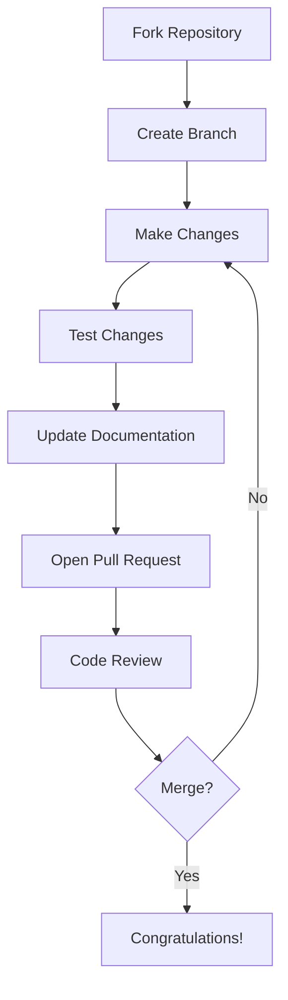
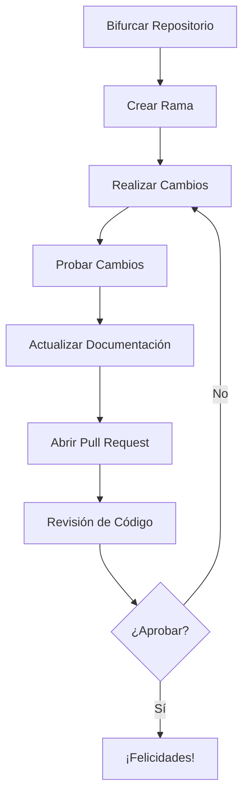

<!-- HEADER CON LOGOS OPTIMIZADOS -->
<div align="center">
  <picture>
    <source media="(prefers-color-scheme: dark)" srcset="https://github.githubassets.com/images/modules/logos_page/GitHub-Mark-120px-plus.png">
    <source media="(prefers-color-scheme: light)" srcset="https://github.githubassets.com/images/modules/logos_page/GitHub-Logo.png">
    
  </picture>
  
  <h1 style="border-bottom: none; margin-top: 20px;">✨ Dotfiles Contribution Guide ✨</h1>
</div>

---

## **🌍 Bilingual Guide**  
*(Click [here](#-español) for Spanish version | Haz clic [aquí](#-english) para versión en inglés)*

---

<div id="-english"></div>

# 🇬🇧 **ENGLISH VERSION**

## 📜 **Code of Conduct**  
We adhere to the [Contributor Covenant](https://www.contributor-covenant.org/version/2/1/code_of_conduct/).  
🔍 **Report issues**: maintainer@example.com  

## 🚀 **Contribution Workflow**



## 🛠 **How to Contribute**

### **1. 🐛 Reporting Bugs**
```markdown
**Environment**:
- OS: [e.g. macOS Sonoma]
- Shell: [e.g. zsh 5.9]
- Dotfiles Version: [e.g. v2.3.1]

**Steps to Reproduce**:
1. ...
2. ...

**Expected Behavior**:
**Actual Behavior**:
```

### **2. 💡 Feature Requests**
```markdown
**Description**:
**Motivation**:
**Proposed Solution**:
```

### **3. 📦 Pull Requests**
- Branch naming: `feat/name` or `fix/issue-#`
- Required checks:
  - [ ] Tests pass
  - [ ] Documentation updated
  - [ ] CHANGELOG entry

---

<div id="-español"></div>

# 🇪🇸 **VERSIÓN EN ESPAÑOL**

## 📜 **Código de Conducta**  
Adoptamos el [Contributor Covenant](https://www.contributor-covenant.org/es/version/2/1/code_of_conduct/).  
🔍 **Reportar problemas**: mantenedor@example.com  

## 🚀 **Flujo de Contribución**



## 🛠 **Cómo Contribuir**

### **1. 🐛 Reportar Errores**
```markdown
**Entorno**:
- SO: [ej. Ubuntu 22.04]
- Shell: [ej. bash 5.1]
- Versión: [ej. v2.3.1]

**Pasos para Reproducir**:
1. ...
2. ...

**Comportamiento Esperado**:
**Comportamiento Actual**:
```

### **2. 💡 Solicitar Funcionalidades**
```markdown
**Descripción**:
**Motivación**:
**Solución Propuesta**:
```

### **3. 📦 Pull Requests**
- Nombrado de ramas: `feat/nombre` o `fix/issue-#`
- Requisitos:
  - [ ] Pruebas exitosas
  - [ ] Documentación actualizada
  - [ ] Entrada en CHANGELOG

---

<!-- FOOTER WITH BADGES -->
<div align="center" style="margin-top: 40px;">
  
  
  <p style="margin-top: 20px;">✨ Thank you for contributing! / ¡Gracias por contribuir! ✨</p>
</div>
