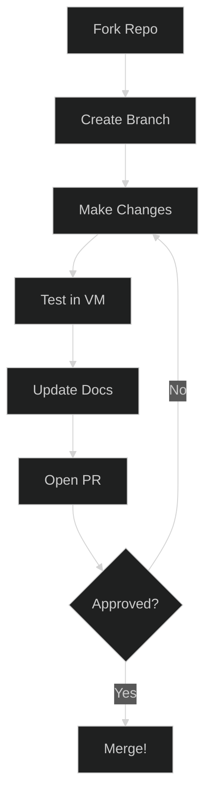
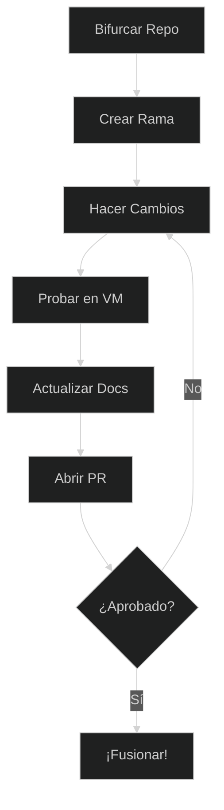

<div align="center">
  <picture>
    <source media="(prefers-color-scheme: dark)" srcset="https://raw.githubusercontent.com/ProDots/HyprZent-v2/main/assets/hyprzent-dark.svg">
    <source media="(prefers-color-scheme: light)" srcset="https://raw.githubusercontent.com/ProDots/HyprZent-v2/main/assets/hyprzent-light.svg">
    
  </picture>
  
  <h1 style="
      font-size: 2.8rem;
      margin: 1rem 0;
      background: linear-gradient(90deg, #6e45e2, #88d3ce);
      -webkit-background-clip: text;
      background-clip: text;
      color: transparent;
      text-shadow: 0 2px 10px rgba(0,0,0,0.1);
  ">
    ✨ HyprZent Contribution Guide ✨
  </h1>
  
  <!-- Badges interactivos -->
  [](https://github.com/ProDots/HyprZent-v2/pulls)
  [](https://hyprland.org)
  [](LICENSE)
</div>

---

## 🌍 Bilingual Guide  
*(Click [here](#english-version) for English | Haz clic [aquí](#versión-en-español) para español)*

---

<div id="english-version"></div>

## 🇬🇧 **ENGLISH VERSION**

### 📜 Code of Conduct  
```diff
+ We follow the [Contributor Covenant](https://www.contributor-covenant.org/version/2/1/code_of_conduct/)  
! Report issues: maintainer@hyprzent.org
```

### 🚀 **Contribution Workflow**

```mermaid
%%{init: {'theme': 'dark'}}%%
graph TD
    A[Fork Repo] --> B[Create Branch]
    B --> C[Make Changes]
    C --> D[Test in VM]
    D --> E[Update Docs]
    E --> F[Open PR]
    F --> G{Approved?}
    G -->|Yes| H[Merge!]
    G -->|No| C
```

### 🛠 **How to Contribute**

#### 🐞 **Reporting Bugs**
```markdown
**Environment**:
- Hyprland Version: [e.g. v0.30.0]
- OS: [e.g. Arch Linux 2023.12.01]

**Steps to Reproduce**:
1. ...
2. ...

**Expected vs Actual Behavior**:
```

#### ✨ **Feature Requests**
```markdown
**Description**:
**Motivation**:
**Example Config**:
```

#### 📦 **Pull Requests**
```markdown
- Branch naming: `feat/name` or `fix/issue-#`
- Requirements:
  - [ ] Tested in VM
  - [ ] Docs updated
  - [ ] Screenshots attached
```

---

<div id="versión-en-español"></div>

## 🇪🇸 **VERSIÓN EN ESPAÑOL**

### 📜 Código de Conducta  
```diff
+ Seguimos el [Contributor Covenant](https://www.contributor-covenant.org/es/version/2/1/code_of_conduct/)  
! Reportar problemas: mantenedor@hyprzent.org
```

### 🚀 **Flujo de Contribución**

```mermaid
%%{init: {'theme': 'dark'}}%%
graph TD
    A[Bifurcar Repo] --> B[Crear Rama]
    B --> C[Hacer Cambios]
    C --> D[Probar en VM]
    D --> E[Actualizar Docs]
    E --> F[Abrir PR]
    F --> G{¿Aprobado?}
    G -->|Sí| H[¡Fusionar!]
    G -->|No| C
```

### 🛠 **Cómo Contribuir**

#### 🐞 **Reportar Errores**
```markdown
**Entorno**:
- Versión Hyprland: [ej. v0.30.0]
- SO: [ej. Arch Linux 2023.12.01]

**Pasos para Reproducir**:
1. ...
2. ...

**Comportamiento Esperado vs Actual**:
```

#### ✨ **Solicitar Funciones**
```markdown
**Descripción**:
**Motivación**:
**Config de Ejemplo**:
```

#### 📦 **Pull Requests**
```markdown
- Nombre de rama: `feat/nombre` o `fix/issue-#`
- Requisitos:
  - [ ] Probado en VM
  - [ ] Docs actualizados
  - [ ] Capturas adjuntas
```

---

<div align="center" style="margin-top:3rem">
  
  <p>✨ Thank you for contributing! / ¡Gracias por contribuir! ✨</p>
</div>
